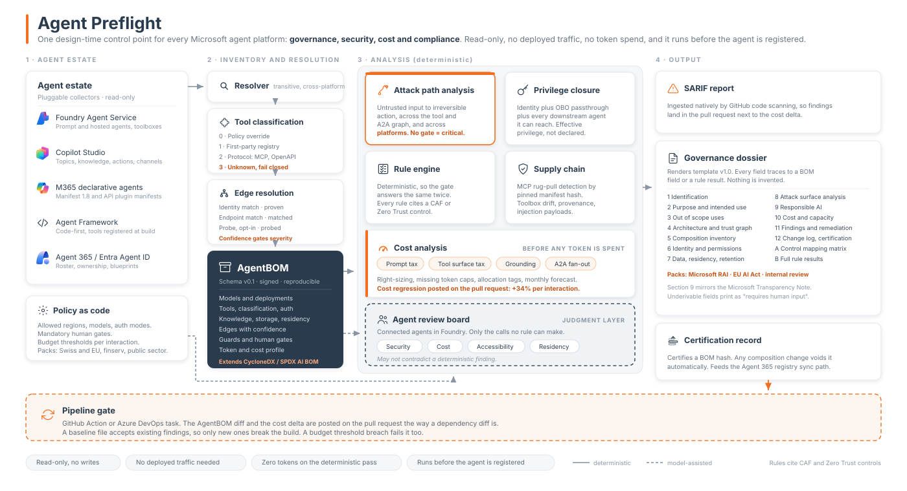

# Agent Preflight

Design-time governance for Microsoft agents, across platforms. Read-only, no deployed traffic, no
token spend, and it runs before the agent is registered.

One control point for **governance, security, cost and compliance**.



## What it finds

Three agents on three platforms, each reviewed and approved on its own:

```
$ preflight scan fixtures --policy policy.example.yaml

CRITICAL  AP-02  Untrusted input reaches an irreversible action across 3 platforms, no human gate
    web content via WebSearch  [Inbox triage, m365-declarative]
      -> POST routeEnquiry (matched, auth none)  -> [Contract router, copilot-studio]
      -> POST callRecordsAgent (matched, auth key)  -> [records-agent, foundry]
      -> delete_record  IRREVERSIBLE (MCP, destructiveHint: true)
    Each hop was reviewed on its own platform. The defect exists only in the composition.
```

Each platform's own tooling sees one hop and reports it clean. The defect exists only in the
composition, and composition is what nothing else inventories. The same path reproduces when the
Foundry agent is read live from a real project rather than from a file.

## Why

Microsoft Foundry ships evaluators, continuous evaluation over live traffic, the AI Red Teaming
Agent and Agent Optimizer. Agent 365 ships a registry that inventories agents across Foundry and
Copilot Studio, with Entra Agent ID providing identity and lifecycle underneath.

Every one of those needs an agent that is already deployed, producing traffic, or registered. None
of them answers the two questions a reviewer actually has to answer:

**Is this safe to ship, and what changed since last time.**

`Azure/PSRule.Rules.Azure` already validates Azure infrastructure as code before deployment and
emits SARIF. Preflight is its missing sibling one layer up.

## What it does

Resolves any Microsoft agent into an **AgentBOM**, a transitive bill of materials covering models,
tools, auth modes, knowledge sources, residency and downstream agents. Then it reasons over it,
deterministically:

- **Attack path analysis.** Untrusted input reaching an irreversible action with no human gate,
  followed across the tool graph, across the A2A graph, and across platform boundaries.
- **Effective privilege closure.** What an agent can reach through delegation, not what it declares.
- **Cost.** Priced from the definition before a token is spent: prompt tax, tool surface tax,
  grounding, and fan-out through delegation.
- **Rule engine.** Every finding carries a rule id, a severity and a named Cloud Adoption Framework
  or Zero Trust control, so a finding is audit evidence rather than an opinion.
- **Supply chain.** MCP tool manifests pinned at approval; a rewrite afterwards fails the build.

Outputs: SARIF for GitHub code scanning, a governance dossier per agent, and a certification tied
to each agent's composition hash that any change voids.

## Quick start

```bash
pip install -e ".[dev]"
preflight scan fixtures --policy policy.example.yaml
```

| Command | Does |
|---|---|
| `preflight scan PATH` | Report, plus `--sarif`, `--dossier`, `--out` for BOMs, `--baseline`, `--lock`, `--cert`, `--fail-on` |
| `preflight collect PATH` | Print the AgentBOMs as JSON |
| `preflight pin PATH --out FILE` | Pin MCP tool manifests, the lock for SC-01 |
| `preflight certify PATH --out FILE --by NAME` | Sign off the current composition of every agent |
| `preflight baseline PATH --out FILE` | Accept today's findings so only new ones fail |

Read Foundry agents live instead of from files, read-only:

```bash
preflight scan fixtures --policy policy.example.yaml \
  --live-foundry https://<account>.services.ai.azure.com/api/projects/<project> \
  --subscription <subscription-id> --region <region> \
  --mcp-manifests fixtures/03-records-agent
```

Always pass `--subscription`: a token minted against the wrong default subscription comes back as a
401 that looks like a Foundry fault.

## In CI

[`.github/workflows/preflight.yml`](.github/workflows/preflight.yml) runs the tests, scans, uploads
SARIF to code scanning and keeps the dossiers as an artifact. The fixtures are deliberately bad, so
their findings are accepted in `preflight.baseline.json`. A pull request fails if it introduces a
new critical finding, or if an MCP tool manifest no longer matches `preflight.lock.json`.

## Design commitments

**The rule engine is deterministic.** A gate must give the same answer twice. Tool classification is
resolved by policy override, then a first-party registry, then protocol metadata (MCP
`ToolAnnotations`, HTTP method, connector metadata), then fail closed. Never by asking a model.

**Untrusted servers can only make things worse.** MCP says clients must treat annotations as
untrusted unless the server is trusted, so a read-only claim from an untrusted server is ignored.
A server declaring its own tool destructive is believed, because nobody overstates their own danger.

**Confidence gates severity.** A path is Critical only when every edge is proven or matched and the
sink's irreversibility is declared rather than assumed. Anything weaker is a possible path, one
level lower.

**Silence is not absence.** A field the platform does not expose is unknown, never false. Rules fire
on explicit bad values only.

**Nothing is invented.** Every dossier field traces to a BOM field or a rule result. Anything that
cannot be derived prints *requires human input*.

**Read-only, always.** No writes to any agent.

## Status

| Built | Roadmap |
|---|---|
| Collectors: M365 declarative agents, Copilot Studio (fixture format), Foundry from files and live | Agent Framework collector; Agent 365 collector, which needs an Agent 365 or E7 licence |
| AgentBOM schema v0.1, identity derived from the composition hash | A real Copilot Studio solution export parser |
| Four-tier classification, edge resolution by identity and endpoint | Probe tier for edge resolution |
| Attack paths, privilege closure, cost, 15 rules | The remaining catalog rules |
| SARIF, dossier, certification, MCP pinning, baselines, GitHub Action | Review board, auto-remediation, estate intelligence |
| 29 tests | |

Full specification: [docs/capabilities.md](docs/capabilities.md). Plan:
[docs/PLAN.md](docs/PLAN.md). Backlog: [BACKLOG.md](BACKLOG.md).

## Not a competitor

Preflight runs before registration and produces exactly the composition metadata that the Agent 365
registry's external-platform sync path ingests. It complements the control plane rather than
duplicating it.

## Provenance

Created for the Microsoft Global Hackathon 2026. Intellectual property created during the hackathon
belongs to Microsoft under the Event Participation and Confidentiality Agreement. This repository
carries no open-source licence and none is implied: all rights reserved. It is public so that
collaborators can read the design and the collector interface, not as a grant of any kind.
